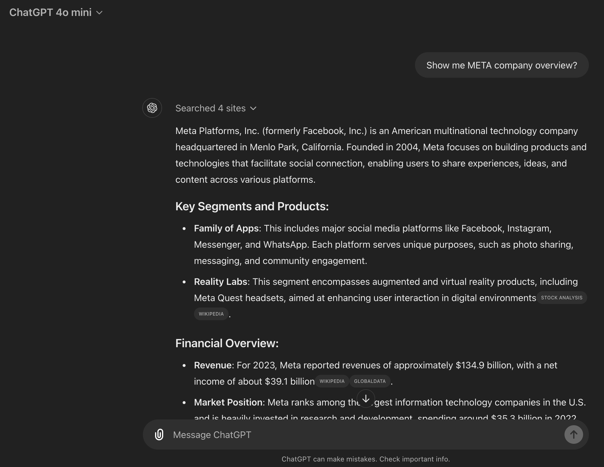

# Finance LLM Bot

This bot uses OpenAI `gpt-4o-mini` that answers finance-specific questions using [function calling](https://platform.openai.com/docs/guides/function-calling) to utilize [Alpha Vantage API](https://www.alphavantage.co/documentation/)

Built with [Streamlit](https://streamlit.io/)

## Comparison

Finance bot vs ChatGPT

### Finance bot responses


Company Overview using AlphaVantage API


Historical Stocks using AlphaVantage API

### ChatGPT responses




As you can see above, finance bot gives more specific finance answers using the AlphaVantage API

## Requirements

It uses the [finance-llm-tool](https://github.com/RohanNankani/finance_llm_tools) for Alpha Vantage Client and also the function tools for the llm to use. 

```bash
cd finance_llm_tools 
pip install -e .
```

## Usage 

```bash
pip install -f requirements.txt
streamlit run financebot.py
```
